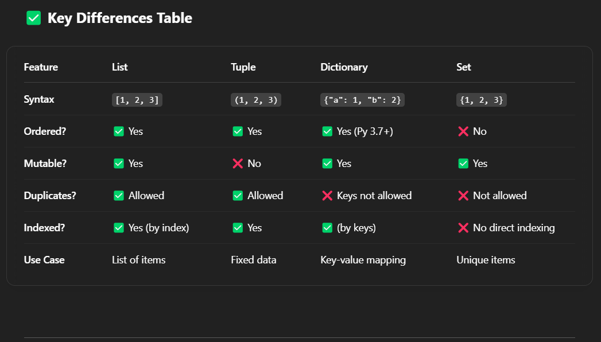

# Big-Data-Engineering-Full
All about my Data engineering Journey
<!-- panda notes -->
Sure! Here's a concise table with key Pandas notes:

Operation	Code	Description
Importing Pandas	import pandas as pd	Import the Pandas library.
Creating a DataFrame	df = pd.DataFrame(data)	Create a DataFrame from a dictionary or list.
Read CSV	df = pd.read_csv('file.csv')	Read data from a CSV file into a DataFrame.
View First Rows	df.head()	View the first 5 rows of the DataFrame.
View Last Rows	df.tail()	View the last 5 rows of the DataFrame.
Get Column Names	df.columns	Get the column names of the DataFrame.
Basic Info	df.info()	Get basic information about the DataFrame (e.g., data types, null values).
Select a Single Column	df['column_name']	Select a specific column from the DataFrame.
Select Multiple Columns	df[['col1', 'col2']]	Select multiple columns from the DataFrame.
Select a Row by Index	df.iloc[0]	Select a row by index number (e.g., first row).
Condition-based Filtering	df[df['Age'] > 25]	Filter data based on a condition (e.g., Age greater than 25).
Check Missing Values	df.isnull().sum()	Check for missing (null) values in the DataFrame.
Drop Rows with Missing Values	df.dropna()	Drop rows containing missing (null) values.
Fill Missing Values	df.fillna(0)	Fill missing (null) values with a specified value (e.g., 0).
Sort by Column	df.sort_values(by='Age')	Sort the DataFrame by a specified column.
Add a New Column	df['New_Column'] = [1, 2, 3]	Add a new column to the DataFrame.
Group By & Aggregate	df.groupby('Age').mean()	Group data by a column (e.g., 'Age') and apply an aggregation function (mean).
Save to CSV	df.to_csv('output.csv', index=False)	Save the DataFrame to a CSV file, excluding the index column.
This table summarizes the most commonly used operations in Pandas. Let me know if you need more details!

Reason

Search

ChatGPT can make mistakes. Check important info.

✅ Key Differences Table
Feature	List	Tuple	Dictionary	Set
Syntax	[1, 2, 3]	(1, 2, 3)	{"a": 1, "b": 2}	{1, 2, 3}
Ordered?	✅ Yes	✅ Yes	✅ Yes (Py 3.7+)	❌ No
Mutable?	✅ Yes	❌ No	✅ Yes	✅ Yes
Duplicates?	✅ Allowed	✅ Allowed	❌ Keys not allowed	❌ Not allowed
Indexed?	✅ Yes (by index)	✅ Yes	✅ (by keys)	❌ No direct indexing
Use Case	List of items	Fixed data	Key-value mapping	Unique items
